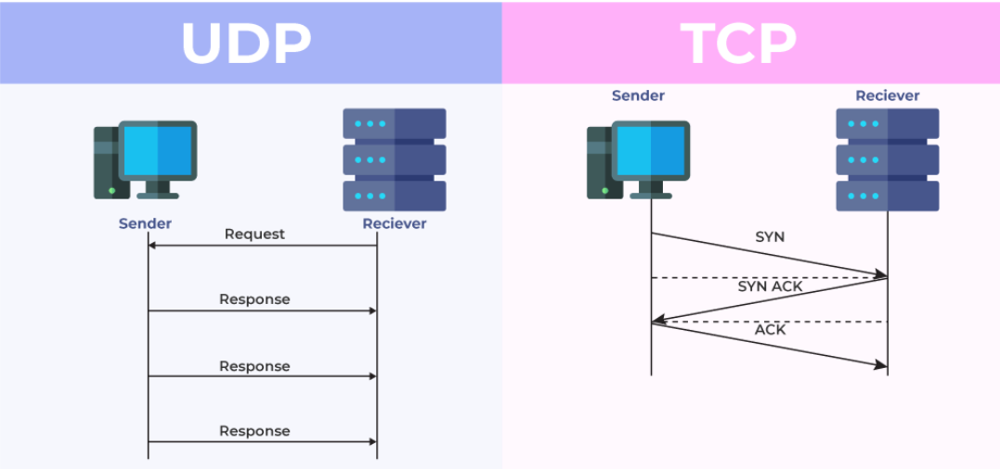
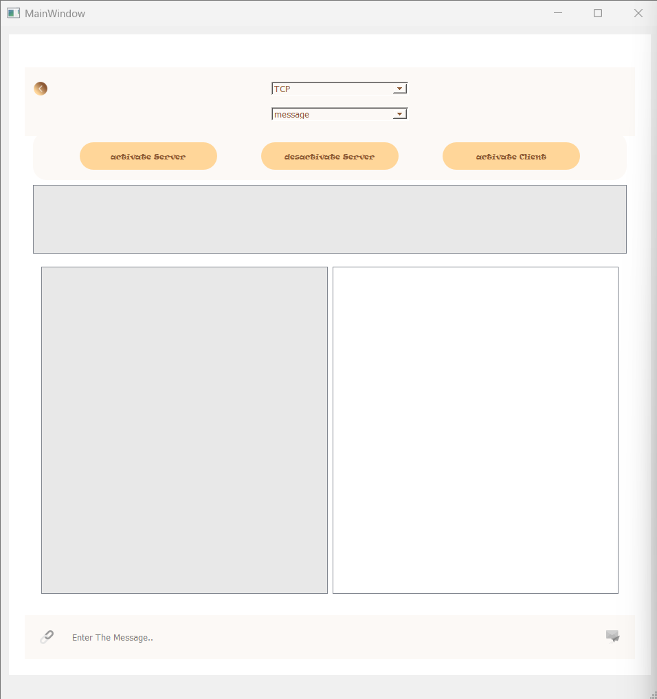
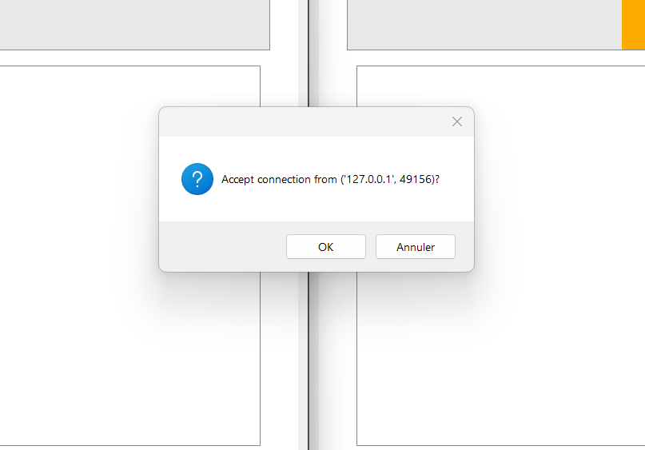
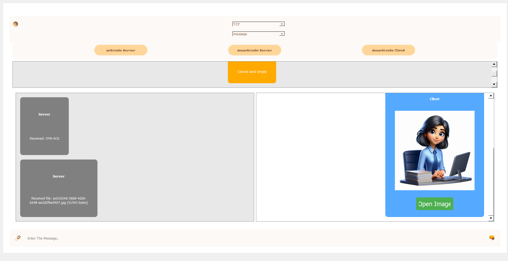

# 📡 Chat App (TCP & UDP)

A simple **client-server chat application** built with **Python**, **PyQt5**, and **Sockets**.  
It supports **TCP and UDP communication**, **file transfer**, and a clean **chat-like interface**.
 <p align="center">
    
 </p>

---
 
## 🚀 Features
- 🔗 **TCP & UDP modes** (selectable from the UI)
- 💬 **Send & receive text messages**
- 📂 **Send & receive files** (images, PDFs, videos, etc.)
- 🎨 **Modern PyQt5 interface** (`scr/TcpUdp.ui`)
- 📁 **Received files saved automatically** in `src/received_files/`
- 🖼️ **Custom icons** stored in `src/Icons/`

---

## 🛠️ Requirements
- Python **3.x**
- [PyQt5](https://pypi.org/project/PyQt5/)

Install dependencies:
```bash
pip install PyQt5
```

---

##📥 Installation

Clone the repository:
```bash
git clone https://github.com/BenkabaMarwa/Chat-App-TCP-UDP.git
cd Chat-App-TCP-UDP
```

---

## ▶️ How to Run

1️⃣ Start the Server
```bash
cd src
python Server.py
```

2️⃣ Start the Client
```bash
cd src
python Client.py
```

3️⃣ Select Protocol

From the dropdown menu, choose TCP or UDP.

4️⃣ Start Chatting

Type and send messages.

Transfer files between client and server.

---

## 📸 Screenshots

1. 💬 Chat Interface  
 <p align="center">
   
 </p>

3. 🔗 The client sends a connection request to the server  
 <p align="center">
   
 </p>

5. 📑 Switching between different message types (text, image, file)  
 <p align="center">
   
 </p>


---

## 📂 Project Structure

├── src/
│   ├── Client.py          # Client-side application (PyQt5 UI)
│   ├── Server.py          # Server-side application (console-based)
│   ├── TcpUdp.ui          # Qt Designer interface file
│   ├── received_files/    # Folder where received files are stored
│   ├── Icons/             # UI icons
└── README.md              # Project documentation

---

## 📜 License

This project is licensed under the MIT License – see the LICENSE
 file for details.

---

## ⚠️ Important Note
Please ignore the following files in the root directory as they are **not part of the working project**:  
`Client.py`, `Server.py`, `TcpUdp.ui`, `received_file.zip`, `Icons.zip`.

👉 The **correct and working code** is located in the [`src/`](src/) folder.

---

## 👩‍💻 Created By
 Marwa Benkaba
 [GitHub Profile](https://github.com/BenkabaMarwa)


